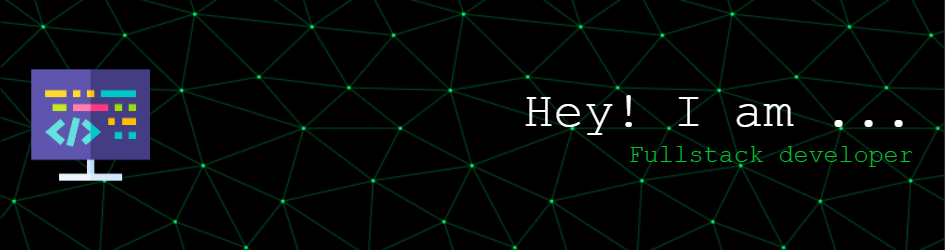

<h1 align="center">Hi , I'm Aakash Saini😁</h1>

- 🔭 I’m currently working on **NextJs.**

- 🌱 I’m currently learning **DevOps Technologies**

- ☁️ I've a keen interest in Web3.

- 💬 Ask me about **ReactJs, NextJs and NodeJs**

    
    

<h1>Socials</h1>

    
    
    
    
    

 
 
 
 
 
 
 
 

# Technologies That I Know👨🏻‍💻:

  

 
 

 

 

&nbsp;

